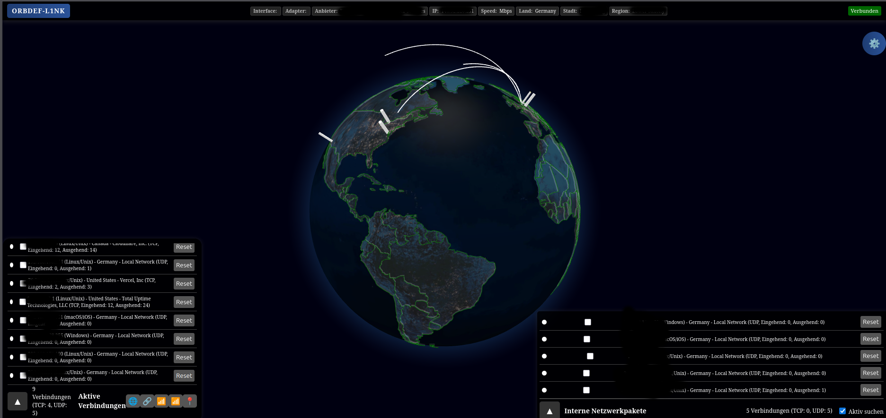

# ConnectSpoofer




ConnectSpoofer is a modular network intelligence component of the **GDEF Suite**. It captures authorized network traffic, enriches observed endpoints, and visualizes live connections on an interactive 3D globe for defensive analysis, lab work, and internal security operations.

It is designed as a standalone module that can be run independently today and integrated into larger GDEF Suite workflows over time.

## Features

- **Live packet visibility**: Captures TCP, UDP, and ICMP traffic with Scapy.
- **3D geo-visualization**: Displays external connections on an interactive globe.
- **Local network discovery**: Detects local devices and mDNS activity.
- **Threat enrichment**: Uses FireHOL-style blocklist data for basic reputation context.
- **Operational controls**: Supports TCP/UDP filters, local/external toggles, pinned IPs, and live statistics.
- **Suite-ready structure**: Keeps runtime configuration, datasets, scripts, and web assets separated for modular GDEF Suite integration.

## Requirements

- Python 3.11+
- `uv` recommended for Python dependency management
- Administrator/root privileges for packet capture
- Linux/macOS: `libpcap`/`tcpdump` packages where required by the platform
- Windows: Npcap or WinPcap

## Quick Start

ConnectSpoofer is protected by a token-based login. The access token is generated on first start and stored securely in `database/access_token.txt`.

### Windows (Recommended)

1.  **Install Npcap**: Download and install from [npcap.com](https://npcap.com/). Select "Install Npcap with WinPcap API-compatible Mode".
2.  **Run Launcher**: Right-click `start.bat` and select **"Run as Administrator"**.
    *   The script will automatically harden the `database/` folder permissions (only you and Administrators will have access).
    *   It will synchronize dependencies using `uv` (or `pip` fallback).
3.  **Access Dashboard**: Open `http://localhost:8000`.
4.  **Login**: Find your access token in `database/access_token.txt`.

### Linux / macOS

1.  **Install & Setup**:
    ```bash
    sudo ./run.sh install
    ```
2.  **Start the Service**:
    ```bash
    sudo ./run.sh start
    ```
    *   *Note: Use `sudo ./run.sh logs` to follow the output.*
3.  **Access Dashboard**: Open `http://localhost:8000`.
4.  **Login**: Retrieve your token: `cat database/access_token.txt`.

## Service Commands (Linux/macOS)

```bash
sudo ./run.sh install   # install system packages, sync Python deps, configure interface
sudo ./run.sh start     # start ConnectSpoofer in the background
sudo ./run.sh stop      # stop the running process
sudo ./run.sh restart   # stop and start again
sudo ./run.sh status    # print running/stopped state
sudo ./run.sh logs      # follow app.log
```

### Least-Privilege Mode (Linux)

You can run ConnectSpoofer without full `root` by granting specific network capabilities to the Python interpreter:

```bash
# Grant capabilities once
sudo setcap cap_net_raw,cap_net_admin=eip "$(readlink -f .venv/bin/python)"

# Now run without sudo
./run.sh start
```

## Security & Privacy

ConnectSpoofer is built with a **Security-First** approach:
- **Authentication**: Mandatory token-based login (Timing-safe comparison).
- **Hardened Sessions**: HTTPOnly, SameSite=Lax, and Secure-cookie support.
- **XSS Protection**: Strict HTML escaping and a robust Content Security Policy (CSP).
- **CSRF Protection**: Cryptographic tokens for all state-changing actions.
- **DoS Resilience**: In-memory resource limits and Socket.IO rate limiting.
- **Data Protection**:
    - **Windows**: ACL hardening (icacls) for sensitive data.
    - **Linux**: Secure umask (077) and private directory permissions (0700).
- **Least Privilege**: Support for Linux capabilities (`setcap`).

### Security Environment Variables

| Variable | Default | Purpose |
| --- | --- | --- |
| `FLASK_SECRET_KEY` | random | Stable session signing key |
| `SESSION_COOKIE_SECURE` | off | Set to `1` when using HTTPS |
| `LOGIN_MAX_ATTEMPTS` | `5` | Failed logins per IP before lockout |
| `SOCKET_RATE_LIMIT` | `5` | Max Socket.IO events per second per client |
| `ALLOW_INSECURE_GEO_API`| `1` | Set to `0` to disable HTTP fallbacks (ip-api.com) |

## Python Workflow

This repository follows current Python packaging practice with `pyproject.toml`, `.python-version`, and `uv.lock`.

```bash
uv sync
uv run python app.py
uv run ruff check .
```

Runtime dependencies are declared in `pyproject.toml`. `uv.lock` records resolved versions for reproducible environments. `requirements.txt` is kept as a legacy fallback for systems without `uv`.

## Configuration

Generated runtime files live in `database/` and are ignored by Git where appropriate:

- `backend_conf.json`: selected packet-capture interface
- `trusted_organisations.json`: organization classification data
- `geo_data.db`: generated SQLite cache/database
- `datasets/*.mmdb`: GeoIP datasets

## Project Structure

```text
ConnectSpoofer/
├── app.py                           # Flask server, packet processing, Socket.IO events
├── run.sh                           # Linux/macOS service launcher
├── start.bat                        # Windows launcher
├── select_interface.py              # Interface selection helper
├── debug_interfaces.py              # Interface diagnostics helper
├── pyproject.toml                   # Project metadata and dependencies
├── uv.lock                          # Locked dependency graph
├── .python-version                  # Preferred Python runtime for uv
├── requirements.txt                 # Legacy pip fallback
├── database/                        # Generated configs, DB files, GeoIP datasets
├── static/                          # Frontend assets
├── templates/                       # Flask templates
└── images/                          # Documentation images
```

## Security Notice

ConnectSpoofer is intended only for authorized defensive use:

- Monitor only networks and systems you own or are explicitly authorized to assess.
- Prefer the least-privilege capability setup over full root; only packet capture (`CAP_NET_RAW`) is required.
- Keep the default localhost bind unless you deliberately expose the UI on a trusted network.
- Follow local laws and organizational policy for packet capture and network monitoring.

The author assumes no responsibility for misuse.

## Troubleshooting

### `NPF not found` on Windows
This indicates that Npcap is missing or not running.
- **Fix**: Install Npcap from [npcap.com](https://npcap.com/).
- **Crucial**: Ensure "WinPcap API-compatible Mode" is checked during installation.

### Permission Denied (Linux)
Packet capture requires raw socket access.
- **Solution 1 (Recommended)**: Use the Least-Privilege mode with `setcap` (see above).
- **Solution 2**: Run the service with `sudo ./run.sh start`.

### Login Failed / Token Missing
The dashboard is locked by default.
- **Fix**: Check `database/access_token.txt` for your unique code.
- **Windows**: If you cannot see the file, ensure you ran `start.bat` as Administrator.

### Interface names show only NPF paths
Use the interface diagnostics helper:
```bash
python debug_interfaces.py
```
Or use the interactive selection via launcher:
- **Linux**: `sudo RESELECT_INTERFACE=1 ./run.sh start`
- **Windows**: Press `I` when prompted by `start.bat`.

## License

MIT. See [LICENSE](LICENSE).

## Author

arn-c0de

GitHub: [@arn-c0de](https://github.com/arn-c0de)
